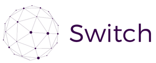
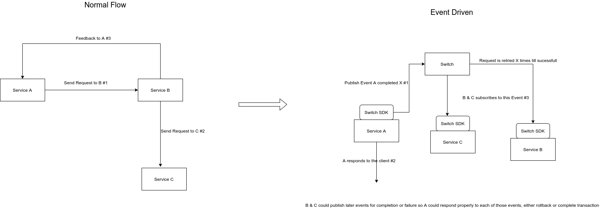
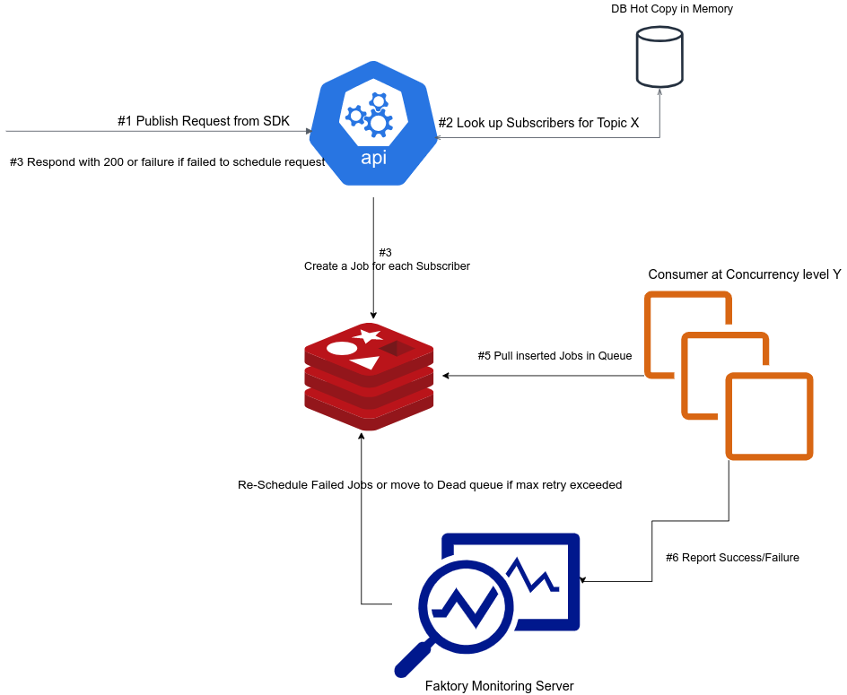

# 

[](https://opensource.org/licenses/MIT)
[](https://github.com/Kareem-Emad/switch/actions)
[](https://goreportcard.com/report/Kareem-Emad/switch)

Dynamic event managment service based on publisher/subscriber model, it allows your service call sequence to be
as dynamic as a DB change

## setup

To run server

```shell
make run
```

to run worker

```shell
virtualenv --python=python3 venv
venv/bin/pip install -r consumer/requirements.txt
venv/bin/python consumer/main.py
```

## Environment Variables

List of envs needs to be setup before starting the service

- `FAKTORY_URL` url for the faktory server to connect to
- `SWITCH_JWT_SECRET` secret used to verify signature of the publisher/sender
- `SWITCH_DB_NAME` name of the sqlite instance used
- `SWITCH_PRODUCTION_QUEUE` name of the queue used for switch jobs
- `SWITCH_PRODUCTION_QUEUE_NAMESPACE` the job type you want the consumer/producer to use
- `SWITCH_CONSUMER_CONCURRENCY_LEVEL` how many concurrent instances of consumer
- `SWITCH_SERVER_PORT` port used by the switch server

## SDK

Currently we have sdks for:

- python: <https://github.com/Kareem-Emad/switch-py>
- javscript: <https://github.com/Kareem-Emad/switch-js>

## DB Schema and Seeding Subscribers Data

The database contains one table called `subscriber`, containing 3 Fields:

| Field | Description |
| --- | --- |
| `filter_expression` | a boolean expression to make sure the message is appropriate for this subcriber, the expression could check on any field in the request data sent by the sdk|
| `target_url` | url to be used in the request for this subscriber |
| `topic` | topic to trigger this subscriber by |

filter example

```python
'data["body"]["x"] == 1 and data["headers"]["y"] == "z" or data["special_key"] == "special value"'
```

Note that all data is under the variable called `data`, so it's important to use that dict in your expression or it will fail

Also make sure to check the key exists before acessing it if you are not sure it always exits, example

```python
'data["http_method"] == "post" and data["body"]["x"] and data["body"]["x"]["y"]'
```

To seed the database, you need to create a record for each subscriber containing the fields mentioned above. on the sdk side, calling publish with the topic name should be enough to trigger all subs registered for this topic. The request specs is mentioned in details in the sdk readme.

sample seed script

```go
package main

import (
	"github.com/Kareem-Emad/switch/dal"
)

func main() {
    dal.CreateSubscriber("True", "https://google11.com", "t1") // expression is always true means it will be triggered by any message for this topic
	dal.CreateSubscriber("True", "https://google12.com", "t1")
}
```

## How it Works

- The service acts as a hub for events, it has a record for each subscriber, his url, the topic triggered by and the filter expression
- Whenever a publish request is triggered from one of the sdks, the service immediately looks up all subscribers interested in this topic.
- It then fires a request with the data specification sent from the sdk to all subscribers
- Worth to Note that there is a filtering step right before sending a request to the subscriber, it evaluates the expression stored in the subscriber record, if the expression is satisifed, then the request is sent
- the expression is a boolean expression that could do basic check on the request data(body, headers, ..) to make sure the subscriber is truely interested in such message.

- Below is a usecase to transform a tightly coupled sequence of requests to a totally independent services, each service now can act properlly when it recieves the proper event, it does not need to know anything about other services or the flow of requests happening, you could remove B&C,  replace them with a totally different structure, and A will still work as long as the events are in the expected format


## Architecture

The main flow of the service design is as shown below in the diagram:

- A request is sent from the sdk.
- Authentication flow kicks in implicity first ofcourse.
- The topic is looked up for the list of subscirbers matching this topic
- A job is created for each subscriber with the data provided in the request
- Faktory server handles retries and dead letting.


